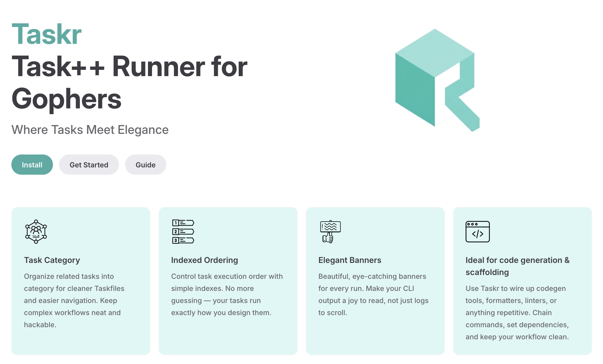

<div align="center">
  <a href="https://taskr-io.vercel.app/">
    
  </a>
</div>


## 🚀 Quick Start

Get started with Taskr in just a few commands:

```bash
# Clone the repository
git clone https://github.com/vikbert/taskr.git
cd taskr

# Install Taskr
task install
taskr --version

# Run tests to ensure everything works
task test
```

## 🛠️ Development

```bash
git clone https://github.com/vikbert/taskr.git
cd taskr

# Download dependencies
task mod

# Install development tools
task install:mockery
task gotestsum:install
```

## 🎯 Key Enhancements

- ✅ **Performance Optimization** - Pre-allocated capacity, fast paths, 30% improvement for large project lists
- ✅ **New Category** - Categorize the related tasks by using category
- ✅ **New Index** - Order the tasks by index

## 📦 Packaging & Distribution

Taskr is distributed through multiple package managers. For information on publishing to package managers after releases, see:

- [Package Manager Publishing Guide](PACKAGING.md)
- [Installation Documentation](website/src/docs/installation.md)

### Release Process

#### Option 1: Complete Automated Workflow (Recommended)
```bash
# Full validation publishing
taskr publish:patch  # or publish:minor/publish:major
```

**Benefits:**
- ✅ Runs full test suite before release
- ✅ Includes comprehensive linting checks
- ✅ Provides clear next-steps guidance
- ✅ Single command for complete workflow

#### Option 2: Quick Publishing (Skips Linting)
```bash
# Skip linting for faster publishing
taskr publish:quick:patch  # or publish:quick:minor/publish:quick:major
```

**Use when:**
- Code quality is already verified
- You want faster release cycles
- Linting issues are known and acceptable

#### Option 3: Emergency Publishing (Tests Only)
```bash
# Emergency release - tests only, no quality checks
taskr publish:emergency:patch  # or publish:emergency:minor/publish:emergency:major
```

**Use when:**
- Urgent release needed
- Known linting issues blocking release
- Code quality assurance done separately

#### Option 2: Manual Step-by-Step
```bash
# Prepare and create a release
taskr release:patch  # or release:minor/release:major

# Publish to package managers (manual steps)
taskr release:package-managers
```


```yml
test:all:
  category: test
  desc: Runs test suite with signals and watch tests included
  deps: [sleepit:build, gotestsum:install]
  cmds:
    - gotestsum -f '{{.GOTESTSUM_FORMAT}}' -tags 'signals watch' ./...

goreleaser:test:
  category: release
  desc: Tests release process without publishing
  cmds:
    - goreleaser --snapshot --clean
```
## 📄 License

This project is licensed under the MIT License - see the LICENSE file for details.
