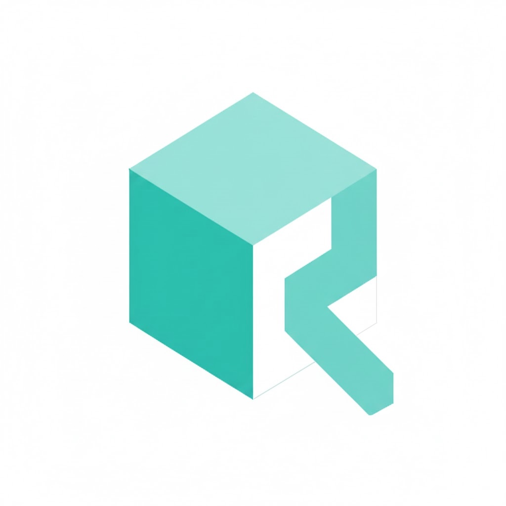

<div align="center">
  <a href="#">
    
  </a>

  <h1>Taskr</h1>

  <p>
    A high-performance golang task runner <br>extended from <b>vikbert/taskr</b> <br> with the rich enhancements.
  </p>

  
</div>

---

## 🚀 Quick Start

Get started with Taskr in just a few commands:

```bash
# Clone the repository
git clone https://github.com/vikbert/taskr.git
cd taskr

# Install Taskr
task install
taskr --version

# Run tests to ensure everything works
task test
```

## 🛠️ Development

```bash
git clone https://github.com/vikbert/taskr.git
cd taskr

# Download dependencies
task mod

# Install development tools
task install:mockery
task gotestsum:install
```

## 🎯 Key Enhancements

- ✅ **Performance Optimization** - Pre-allocated capacity, fast paths, 30% improvement for large project lists
- ✅ **New Category** - Categorize the related tasks by using category
- ✅ **New Index** - Order the tasks by index


```yml
test:all:
  category: test
  desc: Runs test suite with signals and watch tests included
  deps: [sleepit:build, gotestsum:install]
  cmds:
    - gotestsum -f '{{.GOTESTSUM_FORMAT}}' -tags 'signals watch' ./...

goreleaser:test:
  category: release
  desc: Tests release process without publishing
  cmds:
    - goreleaser --snapshot --clean
```
## 📄 License

This project is licensed under the MIT License - see the LICENSE file for details.
